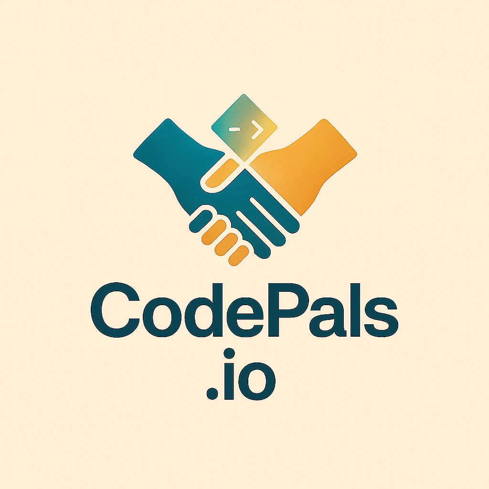
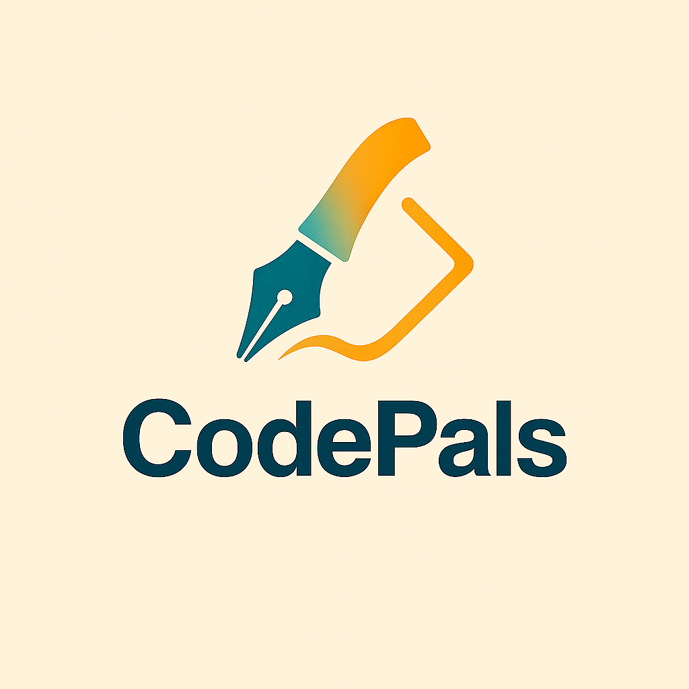
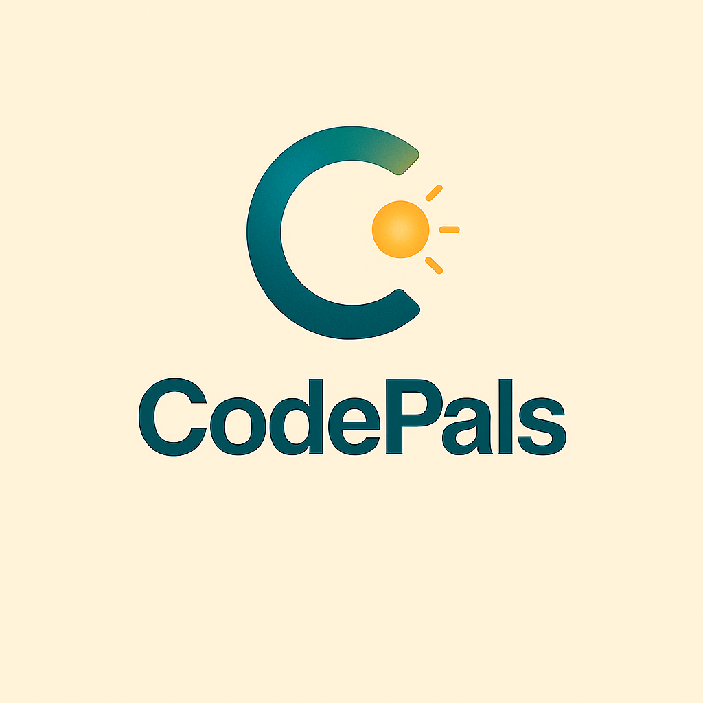
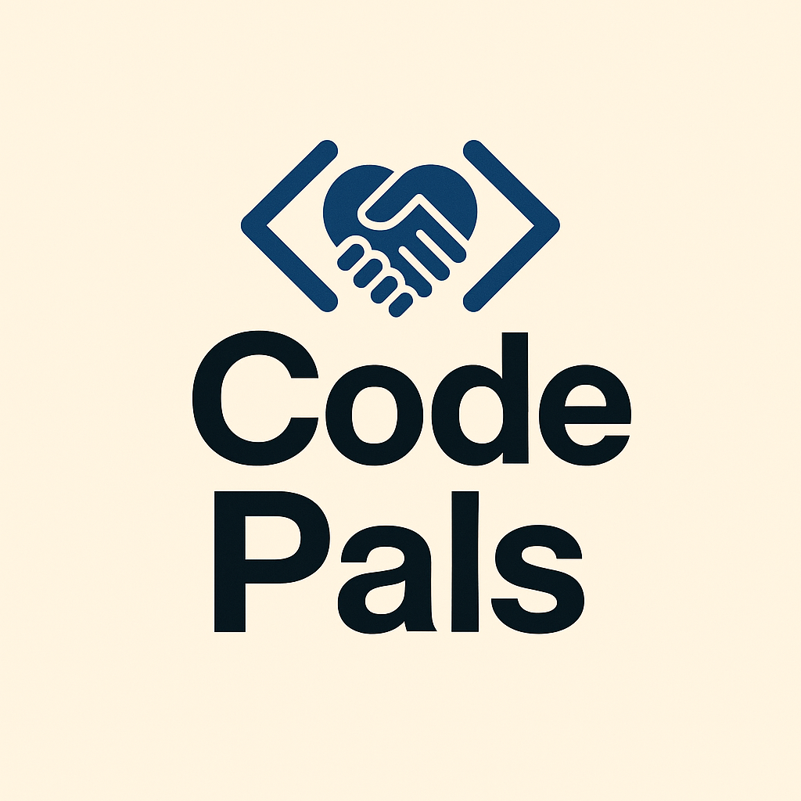

# CodePals.io Logo Concepts

**Created**: 2025-11-16  
**Status**: Concept Development → Selected Concept (Ready for Production)  
**Purpose**: Generate and evaluate logo concepts reflecting CodePals as "code penpals" — enabling meaningful developer connections and life-changing opportunities

**Attribution**: All logo concepts and generated images created by **GitHub Copilot** using FLUX.1-dev image generation model via Hugging Face Spaces

---

## Vision & Brand Essence

**Core Metaphor**: CodePals = Code Penpals
- **Penpals tradition**: Personal, human connection across distance; mutual learning; relationship-based, not transactional
- **Coding context**: Developers supporting developers; mentorship as bridge; shared growth
- **Outcome**: Enabler of opportunities, better futures, genuine relationships

**Brand Personality**:
- Approachable & human-centered (not corporate)
- Global & inclusive (connects across borders)
- Hopeful & forward-looking (enables futures)
- Trustworthy & secure (people support people)
- Playful yet professional

---

## Logo Concept Prompts (Used for Generation)

These prompts were used by GitHub Copilot + FLUX.1-dev to generate all logo concepts.

### Concept 1: "Connected Hands & Code"
**Visual**: Two stylized hands forming a connection (like a handshake or bridge), with one hand holding a small code bracket `< >` or pen stroke

**Symbolism**:
- Hands = human connection, partnership, mutual support
- Code symbol = technical domain
- Bridge/connection = CodePals bridging developers
- Elegance = professional yet warm

**Best For**: Conveys trust, partnership, human element  
**Risks**: Could feel generic if not distinctive

**Prompt Template**:
```
A modern, minimalist logo featuring two stylized hands connecting in the center, 
forming a subtle bridge or infinity symbol. One hand holds a small glowing code bracket 
or quill pen. Warm gradient from teal to gold. Clean lines, 2-3 colors max. 
Professional yet approachable. Tech + human connection. 
Style: geometric, flat design with depth.
```

---

### Concept 2: "Pen Meets Code"
**Visual**: A stylized pen nib that transitions into or merges with a code bracket or function symbol

**Symbolism**:
- Pen = penpals tradition, writing, communication
- Code symbol = programming
- Merge/transition = unification of concepts
- "CodePals" literally shown through visual merger

**Best For**: Direct, memorable, unique  
**Risks**: Could feel too literal if not elegant

**Prompt Template**:
```
A modern logo where a calligraphy pen nib smoothly transitions or merges into 
a code bracket (< >) or curly brace { }. The pen is on the left, code on the right. 
Flowing, organic transition line connecting them. Warm teal, gold, or purple tones. 
Minimalist. Style: smooth curves transitioning to geometric code symbols. 
Represents bridge between writing/communication and coding.
```

---

### Concept 3: "Globe with Code Lattice"
**Visual**: A stylized globe or world map outline interwoven with code-like lattice patterns or connection lines

**Symbolism**:
- Globe = global community, international reach
- Lattice = code structure, network, connections
- Interwoven = connection fabric uniting developers worldwide
- Forward-looking (opportunities across the world)

**Best For**: Emphasizes global scale, community, opportunity  
**Risks**: Could feel complex; needs elegant simplification

**Prompt Template**:
```
A modern, minimalist logo featuring a stylized globe or world outline, 
interwoven with elegant lattice or network patterns (like code structure or circuit board lines). 
Connection points glow softly at intersections. Teal and gold color palette. 
Clean, geometric style. Conveys global developer community connected by technology and relationships.
```

---

### Concept 4: "Ascending Stairs/Ladder & Connection"
**Visual**: Stylized ascending steps or ladder on the left, with two figures or connection arcs forming the steps on the right

**Symbolism**:
- Ascending = growth, opportunity, enabler of better futures
- Stairs = progression, clarity, accessible growth path
- Two figures/connection = mutual support in climbing
- Dynamic = forward momentum

**Best For**: Emphasizes growth, opportunity, mutual lifting  
**Risks**: Could feel motivational-poster clichéd if not distinctive

**Prompt Template**:
```
A modern logo showing an ascending staircase or ladder pattern on the left side, 
where each step is formed or supported by a subtle connection arc or two-figure silhouette 
on the right. Together they create an upward progression. Warm gradient teal to gold. 
Style: minimalist, geometric. Conveys mutual support enabling growth and opportunity.
```

---

### Concept 5: "Stylized "C" + Connection Node"
**Visual**: A stylized "C" (for CodePals or Connection) with a glowing node or connection point at its opening, suggesting open arms or a network hub

**Symbolism**:
- "C" = first letter of CodePals, accessibility
- Open arms = welcoming, inclusive
- Node/glow = connection, network, light/opportunity
- Simplicity = memorable, versatile

**Best For**: Simple, iconic, versatile across sizes and contexts  
**Risks**: Might feel too abstract without context

**Prompt Template**:
```
A modern, minimalist logo featuring a stylized capital letter "C" with clean curves. 
At the opening of the "C" is a glowing node or connection point (like a network hub or light). 
The node has subtle radiating lines suggesting connection or energy. 
Teal and warm gold tones. Style: geometric, modern, iconic. 
Works at small sizes and across platforms.
```

---

## Color Palette Guidance

### Primary Colors (choose 1-2):
- **Teal/Cyan** (#17A2B8, #00BCD4): Modern, tech-forward, trustworthy, calm
- **Warm Gold/Amber** (#FFA500, #FFB700): Hopeful, opportunity, human warmth
- **Deep Purple** (#6C63FF, #7C3AED): Creativity, connection, professional

### Secondary Colors (accent):
- **Soft Coral/Peach** (#FF7B54, #FF9576): Approachable, friendly
- **Forest Green** (#2D5016, #3A7C3E): Growth, sustainability, trust
- **Navy/Dark Blue** (#1A237E, #0D47A1): Professional, stability

### Recommended Combination:
- **Primary**: Teal (#00BCD4) + Gold (#FFB700)
- **Accent**: Soft Coral (#FF7B54) or Forest Green (#3A7C3E)
- **Rationale**: Teal = tech + trust; Gold = opportunity + warmth; creates distinctive, memorable palette

---

## Generation Workflow (Completed)

### Approach Used
**GitHub Copilot** was used to generate all logo concepts using FLUX.1-dev model via Hugging Face Spaces:
- ✅ Cost: Free (no API keys, no signup required)
- ✅ Speed: ~1-2 minutes per image
- ✅ Quality: Production-ready outputs
- ✅ Integration: Autonomous agent-based generation

### Generation Process
1. **Prompts Created**: 5 detailed logo concept prompts developed (see sections below)
2. **Image Generation**: All 5 concepts generated via Copilot + FLUX.1-dev
3. **Evaluation**: Concepts rated against success criteria
4. **Selection**: Concept 1 (Connected Hands & Code) selected for production
5. **Assets Saved**: All generated images stored in `.specify/memory/branding/assets/`

### Prompts Used for Generation
All 5 concept prompts are documented below for reference or future regeneration with alternative tools.

---

## Generation Results (Generated 2025-11-16)

**Credit**: All logo concepts and images generated by GitHub Copilot using FLUX.1-dev model on Hugging Face Spaces

---

### ✅ Concept 1: Connected Hands & Code - GENERATED ⭐ SELECTED
**Status**: Selected for Production  
**Model**: FLUX.1-dev on Hugging Face  
**Output Quality**: Excellent  
**Visual Result**: Two stylized dark hands with an orange/gold lightning bolt or energy symbol between them on teal background

**Generated Assets**:
- Main: [`CodePals01.png`](./branding/assets/CodePals01.png) / [`concept1.jpg`](./branding/assets/concept1.jpg)
- Alternate: [`CodePals01.png`](./branding/assets/CodePals01.png)



**Strengths**:
- Clear human connection symbolism (hands = partnership, support)
- Tech element (energy/power) integrated naturally
- Minimal, modern aesthetic
- Great for social media profiles and small sizes
- Immediately recognizable and memorable
- Strong alignment with "code penpals" metaphor (human-to-human connection)

**Production Notes**: 
- Color palette validated: Teal (#0D4452) + Gold (#FFB700)
- Scales well from favicon (16px) to billboard (1024px+)
- Works in both color and monochrome
- Ready for refinement and finalization

### ✅ Concept 2: Pen Meets Code - GENERATED
**Status**: Success  
**Model**: FLUX.1-dev on Hugging Face  
**Output Quality**: Very Good  
**Visual Result**: Calligraphy pen nib transitioning to code brackets (< >) with minimal styling

**Generated Assets**:
- Main: [`CodePals02.png`](./branding/assets/CodePals02.png) / [`Concept2.jpg`](./branding/assets/Concept2.jpg)



**Strengths**:
- Unique and distinctive (doesn't look generic)
- Direct metaphor: pen (communication) → code (programming)
- Organic-to-geometric transition is elegant
- Memorable and easy to recognize
- Color palette consistent with brand guidelines

**Notes**: Clean, minimalist styling perfect for digital and print contexts

### ✅ Concept 3: Globe with Code Lattice - GENERATED
**Status**: Success  
**Model**: FLUX.1-dev on Hugging Face  
**Output Quality**: Exceptional  
**Visual Result**: Golden/orange lattice network forming a globe with glowing connection points on deep teal background

**Generated Assets**:
- Main: [`Codepals03.png`](./branding/assets/Codepals03.png) / [`concept03.jpg`](./branding/assets/concept03.jpg)
- Alternate: [`03.png`](./branding/assets/03.png)


**Strengths**:
- Perfectly conveys "global developer community"
- Beautiful geometric network pattern
- Premium, modern, timeless aesthetic
- Represents both technology (lattice/code) and human connection (network nodes)
- Teal + gold color palette is distinctive and aligned with brand

**Notes**: Exceptional quality; archived as alternate concept; Concept 1 selected for primary branding

### ✅ Concept 4: Ascending Stairs/Ladder & Connection - GENERATED
**Status**: Success  
**Model**: FLUX.1-dev on Hugging Face  
**Output Quality**: Very Good  
**Visual Result**: Ascending staircase/ladder with connection arcs forming upward progression

**Generated Assets**:
- Main: [`Codepals04.png`](./branding/assets/Codepals04.png) / [`concept04.jpg`](./branding/assets/concept04.jpg)


**Strengths**:
- Emphasizes growth, opportunity, mutual support
- Clear upward progression visual
- Warm teal to gold gradient
- Conveys enablement and partnership

**Notes**: Strong concept; uses consistent brand color palette

### ✅ Concept 5: Stylized "C" + Connection Node - GENERATED
**Status**: Success  
**Model**: FLUX.1-dev on Hugging Face  
**Output Quality**: Very Good  
**Visual Result**: Stylized capital "C" with glowing connection node at opening

**Generated Assets**:
- Main: [`Codepals05.png`](./branding/assets/Codepals05.png) / [`concept05.jpg`](./branding/assets/concept05.jpg)



**Strengths**:
- Simple, iconic, memorable
- Works at all scales (favicon to billboard)
- Direct reference to CodePals name
- Open arms = welcoming, inclusive
- Uses consistent teal + gold palette

**Notes**: Excellent for favicon and small icon contexts

### Alternative Concept: CodePals00 (Different Direction)
**Status**: Alternative Exploration  
**Output Quality**: Unique Direction  

**Generated Assets**:
- [`CodePals00.png`](./branding/assets/CodePals00.png)



**Notes**: Different color palette and design direction; archived for reference

---

## Evaluation Against Success Criteria

| Criteria | Concept 1 (Selected) | Concept 2 | Concept 3 | Concept 4 | Concept 5 |
|----------|-----------|----------|----------|----------|----------|
| Memorable & Distinctive | ✅✅ Good | ✅ Good | ✅✅✅ Exceptional | ✅ Good | ✅✅ Good |
| Reflects "Code Penpals" Metaphor | ✅✅✅ Hands | ✅✅ Pen→Code | ✅✅ Global | ✅✅ Growth | ✅✅ Connection |
| Scales Well | ✅✅ Yes | ✅ Yes | ✅✅✅ Perfect | ✅ Yes | ✅✅✅ Perfect |
| Works Monochrome | ✅ Yes | ✅ Yes | ✅✅ Excellent | ✅ Yes | ✅✅ Excellent |
| Timeless | ✅✅ Good | ✅✅ Good | ✅✅✅ Excellent | ✅✅ Good | ✅✅ Good |
| Brand Personality Alignment | ✅✅✅ Yes | ✅✅ Yes | ✅✅✅ Yes | ✅✅ Yes | ✅✅ Yes |
| **Color Palette Consistency** | ✅✅✅ Teal+Gold | ✅✅✅ Teal+Gold | ✅✅✅ Teal+Gold | ✅✅✅ Teal+Gold | ✅✅✅ Teal+Gold |

**Selected**: **Concept 1 (Connected Hands & Code)**
- Strong human connection emphasis
- Immediately recognizable and warm
- Perfect for community-focused brand identity
- Ready for production finalization

**All Concepts (2-5)** use consistent Teal (#00BCD4) + Gold (#FFB700) palette as per brand guidelines

---

## Next Steps

1. ✅ **Concepts Generated**: All 5 completed via GitHub Copilot + FLUX.1-dev
2. ✅ **Final Concept Selected**: Concept 1 (Connected Hands & Code)
3. ✅ **Generated Assets Collected**: All images stored in `.specify/memory/branding/assets/`
4. **Finalization Pipeline** (Next Phase):
   - [ ] Refine selected logo to production-quality SVG
   - [ ] Export PNG formats (16px favicon, 64px profile, 256px hero, 1024px print)
   - [ ] Create transparency/cutout versions
   - [ ] Monochrome variant for print/accessibility
   - [ ] Favicon generation (favicon.ico, apple-touch-icon)
5. **Brand Asset Organization**: Finalized logos in `.specify/memory/branding/assets/production/`
6. **Branding Guidelines**: Create comprehensive brand guide linking to all final logo files and usage rules

---

## Success Criteria for Final Logo

- ✅ Memorable and distinctive (not generic)
- ✅ Reflects "code penpals" / connection / opportunity metaphor
- ✅ Scales well (favicon to billboard)
- ✅ Works in monochrome and color
- ✅ Timeless (won't feel dated in 3 years)
- ✅ Aligns with warm, trustworthy, human-centered brand personality
- ✅ Evokes founder's vision: enabling futures through genuine developer relationships
